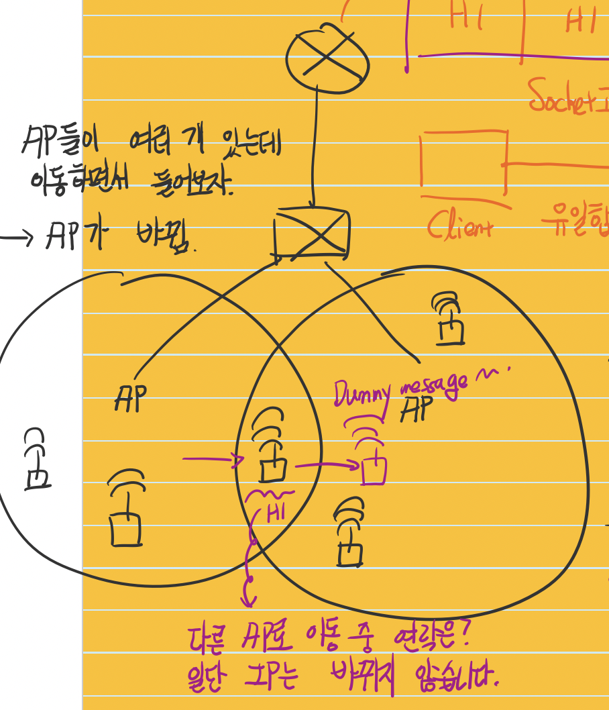

# Mobile network
| Application layer |
| --- |
| Transport layer |
| Network layer |
| **Link layer** |
| Physical layer |

> This is the story about your smartphone.

### Handout..?
> This must save the host's IP Address.
> So if the network(subnet) is changed, the internet is disconnected.

* Very simple, we simply change the switch table!!
  * Switch --> Self learning
  * So we can send the dummy message!
  * Switch learns it!
  * All done!