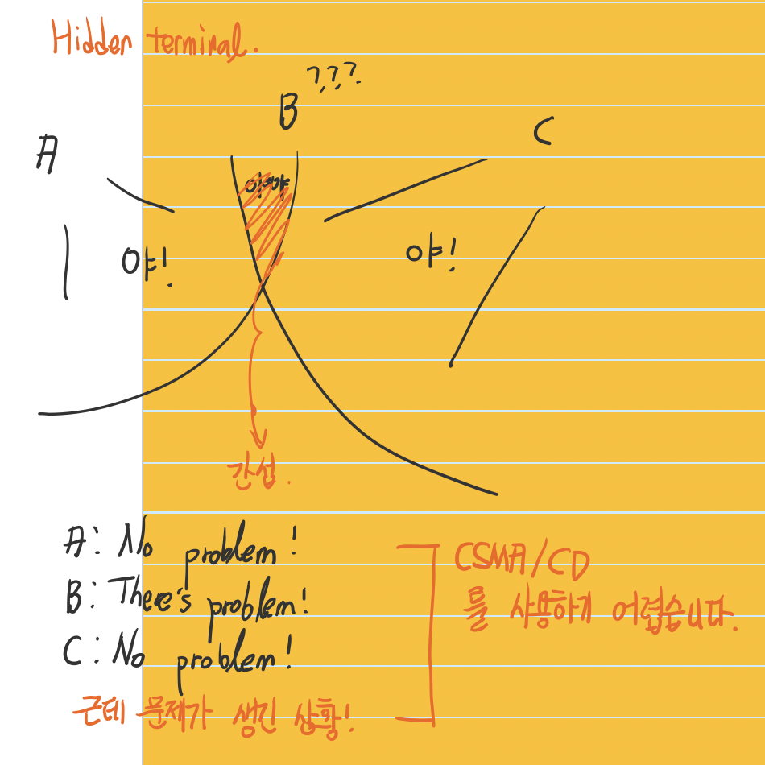

# Wireless network
| Application layer |
| --- |
| Transport layer |
| Network layer |
| **Link layer** |
| Physical layer |

> The story about one hop, in wireless network.
> Basically this is link layer story.

* Decreased signal strength
* Interference from other sources
* Multipath propagation.

### Hidden terminal
> Because of this problem we cannot use CSMA/CD

### Wifi
* AP (Access point) broadcasts beacons which have its information
* In wireless network we cannot detect collision.
  * ACK is needed.
  * CSMA/CA
* Four address fields. (Last address field is deprecated.)
  * Source, AP, Router (Destination field is in IP Packet)  

### CSMA/CA
* RTS (Ready to send) --> I want to use this amount of time!!
  * Lightweight, collision can occurs.
* CTS (Clear to send) --> OK you can use it.
* Data send --> Send data, the other nodes are waiting. Even can sleeping! (Battery saving)
* ACK

> 공유기는 Router + AP, This is lightweight computer (That even has application layer!)
